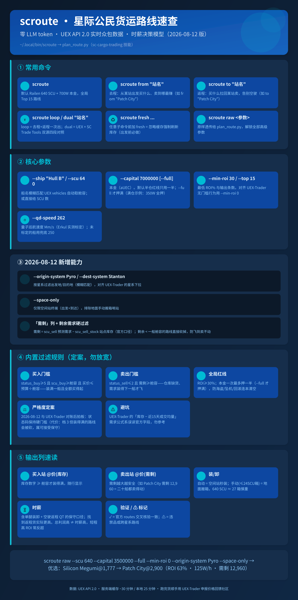

# scroute · 星际公民货运路线速查

敲一条命令，它告诉你现在买什么货、去哪买、拉到哪卖、一趟净赚多少、折合时薪多少。价格来自 UEX 玩家实时众包，不开浏览器，不翻表格，结果直接打在终端里。



## 三分钟上手

**前置条件**：Python 3.10+ 和 curl，Linux / macOS 一般自带。Windows 不装链接也能用，直接跑 `python plan_route.py`，参数见下文「高级参数」。

**第 1 步：装**

```bash
git clone https://github.com/fatinghenji/scroute.git
cd scroute
ln -s "$PWD/scroute" ~/.local/bin/scroute   # 之后任意目录都能直接敲 scroute
```

**第 2 步：改成你的船和本金**

打开 `scroute` 文件，改开头三行：

```bash
SHIP="Railen"      # 你的船名，写个大概就行（如 "Hull B"），会自动匹配舱容
CAPITAL=7000000    # 你账上有多少钱（aUEC）
MIN_ROI=25         # ROI 低于多少不考虑
```

**第 3 步：跑**

```bash
scroute
```

## 跑完会看到什么

```
| # | 商品    | 买入站 @价(库存)     | 卖出站 @价                    | 星系           |  距离 | 装/卸     |   ROI |   利润 | 成本 |   时薪 | 验证 |
+---+---------+----------------------+-------------------------------+----------------+-------+-----------+-------+--------+------+--------+------+
| 1 | Scrap   | ARC-L5 @2,990(2,100) | Endgame @4,600                | Stanton→Pyro⚠ | 100Gm | 自动/自动 | 53.8% | 103.0W | 191W | 164W/h | ✓54% |
| 2 | Silicon | Megumi @1,777(889)   | Patch City @2,900(需剩12,960) | Pyro           |  74Gm | 自动/自动 | 63.2% |  71.9W | 114W | 125W/h | ✓63% |
+---+---------+----------------------+-------------------------------+----------------+-------+-----------+-------+--------+------+--------+------+
```

一行就是一条能直接执行的路线，从左到右读：

- **商品 + 买入站 @价(库存)**：去 ARC-L5 买 Scrap，单价 2,990，站里现货 2,100 SCU，装得满你一船
- **卖出站 @价(需剩)**：拉到 Endgame 卖 4,600；「需剩」是目的地还剩多少需求（预测需求 − 站点现有库存），需剩小于你一船舱容的路线已被直接过滤，不会出现在表里
- **ROI**：这趟投入的回报率 53.8%
- **利润 / 成本 / 时薪**：满仓一趟净赚约 103 万，投入 191 万；把量子巡航、对接、装卸、空驶返程全算进去，折合约 164 万/小时
- **验证 ✓**：已和官方 routes 数据交叉核对过，数字对得上

表上还会标注：⚠（星系列里带 → 表示跨星系，要跳星门）、⚠️违禁品、「手动(≤24SCU箱)」表示装卸要自己动手搬箱（比自动装卸慢得多，大船慎重）。

> 本金默认只押一半（留一半防意外），想全押加 `--full`。

## 最常用的四个命令

```bash
scroute                        # 我现在不知道去哪 → 给我全局最赚的 15 条
scroute from "Patch City"      # 我人在 Patch City → 从这出发买什么、卖到哪
scroute to "Patch City"        # 我要回 Patch City → 半路买什么带回去卖
scroute loop "Patch City"      # 我要跑往返 → 去程+返程一起算好
```

**出发前必做**：库存和价格半小时就变，临起飞前加 `fresh` 强制刷新复核一遍：

```bash
scroute fresh from "Patch City"
```

## 可选：双源核验（dual）

UEX 和 SC Trade Tools 两家数据源互相对照，防止被单一来源的过期价格坑：

```bash
pip install pycryptodome        # 仅 dual 需要，多装这一个包
scroute dual "Patch City"
```

双源按同一本金口径对比（默认半仓，`--full` 时两边都全押）；SCTT 结果同样缓存 25 分钟，`fresh` 会一并刷新。

站点改版可能导致对照失效，修复方法写在 `sctt_routes.py` 开头注释里。

## 高级参数

参数直接跟在 `scroute` 后面即可（可以和 from/to 等子命令混用）；Windows 用户把同样的参数传给 `python plan_route.py`：

```bash
--ship "Hull B" / --scu 640        船名（模糊匹配自动取舱容）或直接给舱容 SCU 数
--capital 7000000 [--full]         本金；默认只用一半，--full 全押
--min-roi 30                       最低 ROI %
--min-profit 500000                 只保留单趟绝对利润 ≥ 50 万 aUEC 的路线（默认 0 = 不过滤）
--origin-system Pyro               只在 Pyro 星系出发
--dest-system Stanton              只卖到 Stanton 星系
--space-only                       只看空间站（排除要手动搬箱的地面哨站）
--qd-speed 262                     你的量子巡航速度 Mm/s（影响时薪估算）
--refresh                          强制刷新价格/库存（静态站点/距离元数据保留 12h 长缓存）
```

例：Pyro 出发、350 万全押、只停空间站：

```bash
scroute --scu 640 --capital 3500000 --full --origin-system Pyro --space-only
```

临时换船或换本金不用改文件，直接加参数：`scroute --ship "Hull B" --capital 5000000 from Baijini`。想让包装器完全不插手、把参数原样交给核心脚本，用 `scroute raw <参数>`。

## 它的推荐逻辑

一条路线要进这张表，得同时过三关。买入站的现货装得满你一船，本金买得起这一船，目的地的「预测需求 − 现有库存」还吃得下这一船。任何一关过不去，这趟就可能白跑，脚本干脆不推荐。

## 数据说明

价格来自 UEX 玩家众包上传，天然有延迟和误差。脚本给的时薪是保守下限，连空驶返程都算进去了，找到返程货实际会更高。众包数据仅供参考，**出发前务必 `fresh` 复核**。本项目与 CIG / UEX 无隶属关系。

直连超时或限速时，脚本自动回退本机代理（可用 `UEX_PROXY` 或 `https_proxy` 环境变量指定，默认 `http://127.0.0.1:43010`），`dual` 双源同样生效。

## 开发

`plan_route.py` 是核心（筛选、时薪模型），`scroute_net.py` 是共用网络层（直连失败自动回退代理），`sctt_routes.py` 是 SCTT 双源对照。核心纯逻辑（时薪模型、筛选三关、缓存清理范围）有单元测试，零依赖直接跑：

```bash
python3 -m unittest discover
```

## License

MIT
